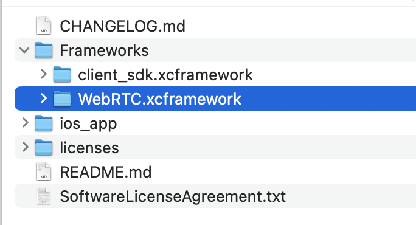
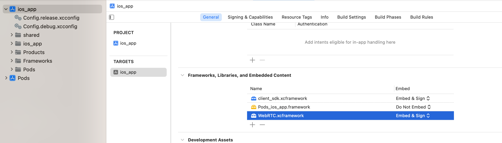

# RICOH Live Streaming Client Sample APP

iOS スマートフォンで RICOH Live Streaming API に接続するアプリ

## 動かし方

### ビルドに必要のツール

* Xcode (推奨バージョン: 15.2)
* CocoaPods (推奨バージョン: 1.14.3)

### サンプルアプリビルド手順

1. ios_app のルートディレクトリで `pod install` を実行
2. Xcode で 手順1で生成された ios_app/ios_app.xcworkspace を開く
3. ReleasesのAssetsより WebRTC.xcframework.zip をダウンロードし、解凍したものを以下の場所に配置する
   
4. ターゲットから ios_app を開き、手順3で配置した WebRTC.xcframework をプロジェクトに追加する
   
5. Config.release.xcconfig/Config.debug.xcconfig の `DEVELOPMENT_TEAM` にチームIDを設定する
6. shared/Settings.swift を開き以下のように設定する
   1. CLIENT_ID = クライアントID
   2. CLIENT_SECRET = クライアントシークレット
   3. ROOM_ID = 接続したいルームID
7. ビルドを実行する

### ビューコントローラー

* LSEmbedCameraAndMicViewController: 内蔵カメラで映像・音声の双方向送受信を行う

## ログ出力

本アプリでは以下のログを出力する。

* Clientログ
  * `/var/mobile/Containers/Data/Application/%UUID%/Documents/Logs/` に出力
* libwebrtcログ
  * `/var/mobile/Containers/Data/Application/%UUID%/Documents/libwebrtc/` に出力
* statsログ
  * `/var/mobile/Containers/Data/Application/%UUID%/Documents/AppLogs/` に出力

ログファイルは以下の手順で取得する
  1. iOS 端末をビルド環境の Xcode と接続する
  2. Xcode メニューから `Window` > `Devices and Simulator` を選択する
  3. `RICOH Live Streaming Client Sample` または `RICOH Live Streaming Client Insta360 Sample` を選択する
  4. `App container actions` から `Download Container...` を選択する
  5. ダウンロードされた App container ファイルから、`パッケージの内容を表示` を選択する
  6. `/AppData/Documents/` から該当パスでログファイルを取得する

### Clientログ

ログ出力には CocoaLumberjack を使用する。アプリも CocoaLumberjack の導入が必要。

SDK の `Client` をインスタンス化する際に、 `ClientLogOption` でログ出力を細やかに設定可能である。

ログ出力レベルは `Error` / `Warn` / `Info` / `Debug` / `Verbose` の 5 段階で設定可能。

設定レベルより上位レベルのログも出力される。つまり `Verbose` レベルに設定するとすべてのログが出力される。そして最上位の `ERROR` レベルのログは常に出力される。

デフォルトで Client ログは `/var/mobile/Containers/Data/Application/%UUID%/Documents/Logs/client_yyyyMMdd_HHmmss.log` という名前で出力される。  

接続時に過去実行時の Client ログを残すために `/var/mobile/Containers/Data/Application/%UUID%/Documents/Logs/yyyyMMdd'T'HHmmss_client_yyyyMMdd_HHmmss.log` という名前のファイルにリネームしている。  
リネーム後のファイル名は実際の日時で `yyyyMMdd'T'HHmmss_client_yyyyMMdd_HHmmss.log` の形式となる。

### libwebrtcログ

`Client#setLibWebrtcLogOption()` を利用することで libwebrtc ログも本体のディスク上に `/var/mobile/Containers/Data/Application/%UUID%/Documents/libwebrtc/webrtc_log_0` という名前で出力することができる。

libwebrtc ログは接続する度に "webrtc" プレフィックスのログファイルを削除して再作成する仕組みのため、  
接続時に過去実行時の webrtc ログを残すために `/var/mobile/Containers/Data/Application/%UUID%/Documents/libwebrtc/yyyyMMdd'T'hhMMss_webrtc_log_0` という名前のファイルにリネームしている。  
リネーム後のファイル名は実際の日時で `yyyyMMdd'T'HHmmss_webrtc_log_{0始まりの連番}` の形式となる。

### statsログ

`Client#getStats()` から取得した `RTCStatisticsReport` をログに出力する機能がある。

`/var/mobile/Containers/Data/Application/%UUID%/Documents/AppLogs/app_yyyyMMdd_hhMMss.log` という名前で出力される。
このログファイルも接続する度に新しいファイルが生成される。

接続時に過去実行時の stats ログを残すために `/var/mobile/Containers/Data/Application/%UUID%/Documents/AppLogs/yyyyMMdd'T'hhMMss_app_yyyyMMdd_hhMMss.log` という名前のファイルにリネームしている。  
リネーム後のファイル名は実際の日時で `yyyyMMdd'T'HHmmss_app_yyyyMMdd_hhMMss.log` の形式となる。

出力可能な情報の一覧は https://www.w3.org/TR/webrtc-stats/ で確認できるが、
libwebrtc の実装に依存するため、記載されているすべての情報が出力できるとは限らない。
